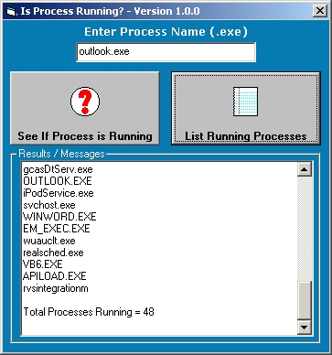



## Find if Process is Runing using Windows Management Instrurmentation \(WMI\)

### Description

Simple function that uses Windows Management Instrurmentation (WMI) to find if Process (task) is running on your system. I used this to detect if pcAnywhere Host (awhost32.exe) was running before I had a Telephone Call Accounting System "Phone Home" using the modem. Then I use the same function to detect that awhost32.exe was stopped before using the modem. After my app was done with the modem and issued the restart of pcAnywhere, used the function to see that awhost32.exe had started. Also included in the sample app is a simple task list.
 
### More Info
 

             |
---                |---
**Submitted On**   |2005-04-15 21:04:10
**By**             |[Mark Mokoski](https://github.com/Planet-Source-Code/PSCIndex/blob/master/ByAuthor/mark-mokoski.md)
**Level**          |Beginner
**User Rating**    |4.8 (29 globes from 6 users)
**Compatibility**  |VB 6\.0
**Category**       |[Windows System Services](https://github.com/Planet-Source-Code/PSCIndex/blob/master/ByCategory/windows-system-services__1-35.md)
**World**          |[Visual Basic](https://github.com/Planet-Source-Code/PSCIndex/blob/master/ByWorld/visual-basic.md)
**Archive File**   |[Finf\_if\_Pr1877254152005\.zip](https://github.com/Planet-Source-Code/mark-mokoski-find-if-process-is-runing-using-windows-management-instrurmentation-wmi__1-60027/archive/master.zip)

